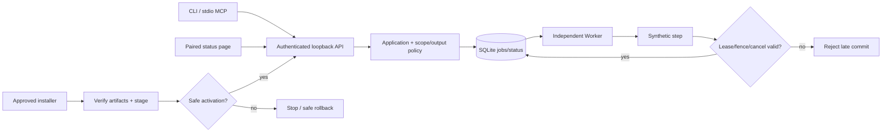

# Phase 1: 契约、原生骨架与最小 beta 安装升级 — Research

**Researched:** 2026-08-27
**Domain:** 本机双平台服务、持久任务、安全配对、安装升级与 beta
**Confidence:** HIGH 官方事实 / MEDIUM 建议组合 / runtime not_run

<user_constraints>
## User Constraints (from CONTEXT.md)

以下逐字复制当前 CONTEXT 的决定、裁量与延期段落。[VERIFIED: .planning/phases/01-beta/01-CONTEXT.md]

## Implementation Decisions

编号于2026-08-27规范为GSD可解析的D-01–D-16，原P1-D01–P1-D16保留作引用别名；仅调整编号格式，用户决定内容不变。

### 启动方式（已确认）
- **D-01:** (原编号 P1-D01) 默认不配置随系统登录自动启动。用户通过 Codex/CLI 按需启动服务；服务启动后独立运行，退出 Codex 不会终止 API/Worker。
- **D-02:** (原编号 P1-D02) 安装或升级流程应自动启动目标服务并自检，展示实际版本、运行状态、旧版本清理结果。这是本次操作后的启动，不是授权系统登录自启动。
- **D-03:** (原编号 P1-D03) 启动、自检和必要清理均完成才报告整个操作成功。版本字符串或 health=200 不能替代实际接线检查；组件不匹配、旧入口/进程仍生效或 cleanup_pending 不能报升级成功。

### 安装/升级交互（已确认）
- **D-04:** (原编号 P1-D04) 开始前展示目标版本、安装位置、需下载的依赖和预计修改；用户确认一次后在该范围内自动执行，不逐条要求用户手装依赖。
- **D-05:** (原编号 P1-D05) 遇到新增权限、无法安全恢复或必须人工操作时暂停；操作系统授权提示由用户本人处理。预览确认不授权超出范围的改动、旧产品卸载或真实课程访问。

### 升级失败默认行为（已确认）
- **D-06:** (原编号 P1-D06) 能够确认不会丢失数据时，自动恢复到上一个可运行版本，明确报告“升级失败，已恢复旧版”。恢复成功不等于目标升级成功；不自动循环重试升级。
- **D-07:** (原编号 P1-D07) 不能保证安全时停止、保留安全的诊断状态并等用户确认。不得覆盖升级后的新写入、运行不兼容 schema 的旧程序、自动破坏性反向迁移或误杀无关进程。“保留现场”不授权记录秘密、HAR、原始请求或私有内容。
- **D-08:** (原编号 P1-D08) 不备份/导出 Profile，不假设浏览器降级可以恢复会话。首次安装没有旧版时不得虚报“已恢复旧版”；具体无旧版失败收尾及回滚安全判据由研究/计划明确，必要人工决定仍暂停。

### 原生测试设备（用户报告，未核验）
- **D-09:** (原编号 P1-D09) 用户有可用于实际安装测试版的 Windows 电脑，系统为 Windows 11；处理器描述为“ultra7 265k可能是”。型号及 CPU 架构待设备检测核实，不能写成已验证硬件或据此声称原生验收通过。
- **D-10:** (原编号 P1-D10) 当前工作区位于 macOS 路径，但实际 macOS 版本/架构未在本次讨论核实。研究/规划需确定依赖支持交集与平台产物矩阵；安装前检测实际系统/架构。不得以 WSL/Linux 替代 Windows 原生证据，不默认承诺所有架构。

### 继承的要求与硬门禁（不重新询问）
- **D-11:** (原编号 P1-D11) 独立本地单用户、macOS/Windows、SQLite+最小持久 Job+本地文件、Local Playwright 唯一真实 Provider；无远程部署或 LLM Key 依赖。旧仓库只读，不复用旧运行配置、数据、Profile 或安装标识。
- **D-12:** (原编号 P1-D12) 安装和升级必须处理本安装受管理旧程序、入口、进程；仅允许明确隔离且不活动的回滚副本。不得将“清理旧版”解释成自动卸载 legacy AutoED，也不得删除课程档案。
- **D-13:** (原编号 P1-D13) 人工验收前先完成适用自动检查、发布可安装且可获取的 beta，再给用户精确更新提示词与测试步骤；用户在 Codex 手动更新并反馈。P1 人工测试只涉及适用安装/升级，学校登录在 P2 认证 beta 之后；发布本身不是测试通过。
- **D-14:** (原编号 P1-D14) M1 目标0.1.0，beta 为0.1.0-beta.N且不可覆盖。远程操作必须分别验证 returdex 认证、repo-local作者/提交者及同名仓库冲突，不能使用 ywan1303；标准 PolyForm Noncommercial 1.0.0及商业另行授权边界不变。
- **D-15:** (原编号 P1-D15) 所有来源权限、数据保护、来源内容不可信、Profile敏感性、持久任务与失败保留最后成功数据规则从首次相关操作生效。严格区分 S/I/N/L，未跑不填 pass。
- **D-16:** (原编号 P1-D16) 本轮只生成讨论上下文。后续相关 PLAN 经用户确认才可连续实现、自动测试修复、构建和批准范围内 beta 发布；必须人工操作/登录/更新/UAT或新决策时停止。通用 auto_advance/_auto_chain_active保持false，不自动进入 plan/execute。

### Research and planner discretion / remaining checks

以下属于研究与规划职责，不冒充用户已选择具体实现：锁定并验证依赖版本、实际 SQLite 引擎/WAL 修复、OS凭据保护、受管依赖与安装路径/标识、稳定入口、升级日志与恢复安全判据、持久任务契约和最小状态呈现。优先官方资料；现有研究版本是候选，需实施前复核。

平台支持矩阵仍是规划前置核实项，不是已完成验证，也不是新里程碑的延期项。需要用户提供无法本机检测的设备信息时只补问缺失事实。不要再次询问是否需要自动安装/升级、双平台或后台独立运行。具体计划仍交用户确认；此次讨论没有批准某个依赖组合、最低系统版本或额外能力。

## Deferred Ideas

无新增范围外能力。完整管理UI（P7）、最终交付与用户级自启动启停（P8）保持既定归属，没有因本次决定删除或另建未来里程碑。平台/依赖核实留给本阶段研究规划，不视为验收豁免。
</user_constraints>

## Summary

本仓库只有规划文档，没有应用源码、测试框架、lockfile 或可安装产品；此次只读取文档、注册表和公开源码，未安装、登录或发布。[VERIFIED: repository file inventory, 2026-08-27]
选用 Node24 受管运行时、Fastify/Zod、better-sqlite3、原生密钥库适配器、纯 HTML/CSS/TypeScript 状态页及 MCP v2 薄客户端；所有具体设计仍为待 PLAN 批准的建议，不把文档核对标作产品验证。[ASSUMED: A1]

**Primary recommendation:** 先实现“受认证真实 HTTP → durable synthetic Job → 独立 Worker → 实际安装入口自检”的最小闭环，再以两个不可覆盖 beta 演练升级；不加入学校连接或完整管理 UI。[ASSUMED: A1]

## Project Constraints (from AGENTS.md)

- 新仓库工作；legacy 726884c 只读，不复制任何旧运行数据、依赖或秘密；不使用已安装旧 AutoED 工具。[VERIFIED: AGENTS.md]
- 本阶段通过 GSD 规划；相关 PLAN 用户批准之前不实现、不安装、不发布；通用自动链保持 false，人工动作绝不自动批准。[VERIFIED: AGENTS.md]
- 单用户本机 macOS/Windows；API/Worker 独立，UI/CLI/MCP/Skill 共用后端，无云服务、LLM Key、远程、多用户、作业辅助或其他项目未来阶段。[VERIFIED: AGENTS.md]
- SQLite+最小 Job+文件；Local Playwright 唯一真实 provider，P1 synthetic；学校密码/MFA 只由用户官方输入，不读录秘密；专属 Profile 敏感、排除 Git/备份/模型/云同步。[VERIFIED: AGENTS.md]
- 不复用日常/Codex Profile、Cookie桥接、未授权端点或源站业务写操作；页面是数据，不接受任意 URL/JS/selector；按来源权利、scope、操作、目的地检查所有出口。[VERIFIED: AGENTS.md]
- 状态维度分离；partial/empty/error/not_observed/deletion 不混同；失败不覆盖成功数据；长期保留；下载/归档/提取/模型可读各报状态。[VERIFIED: AGENTS.md]
- 租约不能证明 OS 进程退出；仅管理本安装拥有的进程；无原始网络/HTML/trace/录像/登录截图；诊断去敏。[VERIFIED: AGENTS.md]
- S/I/N/L 分开；Windows 原生；P2 live 硬门禁；人工测试前必须可获取 beta，用户自己更新反馈。安装升级预览、受管清理、恢复、新旧隔离及独立真实版本检查不可省略。[VERIFIED: AGENTS.md]
- 0.1.0-beta.N 不覆盖；仅 returdex 身份，Git 与远程认证分别核验，同名远程冲突停止；PolyForm Noncommercial1.0.0不改；无全局身份改动。[VERIFIED: AGENTS.md]
- 无实现代码惯例或项目技能可继承；分支 codex/ 前缀；生成模板不得覆盖安全规则，所有敏感数据禁止入库。[VERIFIED: AGENTS.md; no .codex/skills or .agents/skills found]

<phase_requirements>
## Phase Requirements

| ID | Observable requirement (summary) | Research support |
|---|---|---|
| ARCH-01 | 退出客户端后 API/Worker 继续，分别可诊断，无 LLM Key | 分离进程/生命周期与 native 测试 |
| ARCH-02 | 同一 application，domain 无传输/driver，MCP 不开 DB/Profile | 包边界检查和真实 stdio→HTTP |
| PLAT-01 | 声明 OS/CPU/精确依赖，实际 SQLite/WAL 修复 | 注册表版本、产物矩阵、安装后探针 |
| SEC-01 | loopback、配对、Host/Origin/scope/CSRF、OS秘密保护 | 本地配对协议与平台密钥库 |
| JOB-01 | durable job_id、并发租约/fence、去重、取消、有界重试 | 短事务状态机及故障注入 |
| DIST-01 | manifest/API/Worker/CLI/MCP 实际身份一致，不覆盖版本 | 编译身份、互认证、功能探针 |
| DIST-02 | 无手装依赖、双平台、重复安全、两个beta升级恢复 | 原生bootstrap、journal、恢复判据 |
| DIST-03 | beta可获取先于人工检查、returdex/许可/去敏/冲突门禁 | 发布顺序及独立获取校验 |
</phase_requirements>

表中目标均来自批准需求，未验证；下文为具体实施建议。[VERIFIED: .planning/REQUIREMENTS.md Phase1]

## Architectural Responsibility Map

以下是拟定职责分配，均待 PLAN 批准。[ASSUMED: A1]

| Capability | Primary tier | Secondary tier | Rationale |
|---|---|---|---|
| 状态 UI / CLI / stdio MCP | Client | Backend auth | 客户端不读数据库或秘密正文 |
| scope/policy/Job入队/状态读取 | API application | SQLite | 一份业务语义及输出策略 |
| 领取/重试/取消/提交 | Worker application | SQLite | 与客户端寿命无关 |
| 秘密、路径、进程身份 | OS/platform adapter | API/client credential adapter | 不使用跨平台明文降级 |
| 安装journal/激活/回滚/清理 | Installer supervisor | OS + SQLite | 不让待替换进程替换自身 |
| 版本与发布产物 | Release tooling | Runtime probes | 编译身份不能只读可修改manifest |

## Standard Stack

**Version verification:** 2026-08-27 通过 Python urllib 只读 npm registry package metadata（等价 npm view，未执行包）获取 version/time/engines/peers，Node官方index；精确版本是候选，执行首步再复核并锁定。[VERIFIED: registry.npmjs.org; nodejs.org/dist/index.json]

| Library | Candidate | Published | Purpose / evidence |
|---|---|---|---|
| Node / bundled npm | 24.20.0 / 11.19.0 | 2026-08-26 | 独立受管runtime；替换昨日候选24.19.0 [VERIFIED: nodejs.org/dist/index.json] |
| TypeScript | 7.0.2 | 2026-07-08 | strict编译，native工具包需列入构建矩阵 [VERIFIED: npm registry] |
| Fastify | 5.12.1 | 2026-08-18 | 本地HTTP [VERIFIED: npm registry] |
| Zod | 4.4.3 | 2026-05-04 | 单一输入/输出契约 [VERIFIED: npm registry] |
| better-sqlite3 | 13.0.3 | 2026-08-05 | Node>=22，源码SQLite3.53.4 [VERIFIED: npm registry; tagged deps/sqlite3/sqlite3.h] |
| playwright / @playwright/test | 1.62.1 / 1.62.1 | 2026-07-30 | 同版library/test/browser [VERIFIED: npm registry] |
| @modelcontextprotocol/server / client | 2.0.0 / 2.0.0 | 2026-07-27 | v2拆包，非旧sdk包 [VERIFIED: npm registry; official SDK README] |
| @napi-rs/keyring | 1.3.0 | 2026-04-30 | OS Credential Manager/Keychain绑定 [VERIFIED: npm registry; tagged Cargo.toml] |
| @fastify/cookie | 11.1.2 | 2026-07-15 | cookie解析/序列化 [VERIFIED: npm registry] |
| Vitest | 4.1.11 | 2026-08-18 | Node24兼容测试候选 [VERIFIED: npm registry engines] |

不要引入 React/shadcn/Vite UI 工程：批准 UI 只有只读状态与刷新，采用静态HTML/CSS、编译TS，由API提供白名单静态资源；Vitest自身构建依赖照lockfile保留。Zod在application边界显式parse输入和输出，避免仅为此页引入provider/swagger链；不把未经清洗对象直接JSON输出。[ASSUMED: A1]
fastify-type-provider-zod7.0.0存在但peers含swagger/openapi，P1不推荐引入；旧@modelcontextprotocol/sdk最新仍1.30.0，不能把包名与v2混装。v2 SDK自身Zod依赖^4.2.0满足上述候选。[VERIFIED: npm registry]
Playwright1.62.1标签browsers.json指Chromium revision1234、151.0.7922.34；发行清单必须记录实际安装browser.version()和revision，不能只信此表。[VERIFIED: microsoft/playwright v1.62.1 packages/playwright-core/browsers.json]
采用better-sqlite3前，原生加载/实际引擎/backup与keyring两平台均须测试；若不能取得匹配产物，不现场安装编译工具链或静默换数据库，停在兼容门禁修订方案。[ASSUMED: A1]

**Installation (future, PLAN-approved only):** 工作区manifest精确固定以上版本与所有辅助types/test依赖，再生成一次package-lock、后续npm ci；生产交付预编译JS和对应原生依赖，不要求终端用户npm install或Docker。[ASSUMED: A1]
**Alternative:** node:sqlite减少addon，但API成熟度/嵌入引擎随Node绑定；先固定单一better-sqlite3，不维护双driver。原生失败触发ADR，而非假定替换等价。[ASSUMED: A1]

## Architecture Patterns

### System Architecture Diagram

下图为建议数据流，不声明已有实现。[ASSUMED: A1]



### Recommended Project Structure

以下路径及所有新接口为建议，规划时保持唯一归属。[ASSUMED: A1]
```text
apps/{api,worker,cli,mcp,status}/
packages/{domain,contracts,application,persistence,platform,test-support}/
scripts/{build,release,install}/
tests/{unit,integration,native,ui}/
```
domain只含状态/标识不变量；contracts用Zod；application依赖ports；persistence与platform实现ports；每app独立入口。installer可通过受控maintenance adapter进行离线迁移，CLI/MCP不得直接访问业务DB。[ASSUMED: A1]

### Durable jobs and storage

SQLite WAL仍单写者，长读阻塞checkpoint；WAL-reset在3.51.3修复，3.44.6/3.50.7有回补，不能把系统sqlite命令版本当嵌入版本。采用driver标签3.53.4源码与安装后sqlite_version()/sqlite_source_id()双证据。[CITED: https://sqlite.org/wal.html; https://sqlite.org/releaselog/3_51_3.html]
建议schema含jobs(id,scope,idempotency_key,payload_hash,state,attempt,max_attempts,next_run_at,lease_owner,lease_until,fence,cancel_requested,checkpoint,result,error_code)、unique(scope,idempotency_key)；相同key不同payload明确冲突。使用WAL、foreign_keys=ON、synchronous=FULL、有限busy_timeout；I测试决定预算，非性能承诺。[ASSUMED: A2]
BEGIN IMMEDIATE短事务领取并递增fence；heartbeat与完成提交都检查owner+fence+状态+租约有效；checkpoint与业务result同事务。业务幂等提交唯一键另外约束；保证至少一次尝试、最多一次有效提交，不声称恰好执行一次。[ASSUMED: A2]
queued→running→succeeded/failed/cancelled；可重试错误→retry_wait；cancel_requested独立标志，Worker确认停止才cancelled。到期恢复再领取；旧Worker收到失租停止；过程不持DB事务。Profile进程回收P2才实现，P1契约禁止“到期即杀PID”。[ASSUMED: A2]
进程崩溃、睡眠后时钟变化、并发取消/提交、busy、磁盘满必须故障注入；数据错误保留最后成功结果与独立最近失败。P1只写synthetic数据，不提前实现归档提取或课程crawler。[ASSUMED: A2]

### Loopback, pairing and secret storage

绑定127.0.0.1，固定安装选定端口；精确Host（含port）/Origin验证、trustProxy=false、默认无CORS、JSON限额、错误脱敏；CLI/MCP无Origin也必须认证。浏览器同站不等于安全，不能仅靠SameSite。[CITED: https://cheatsheetseries.owasp.org/cheatsheets/Cross-Site_Request_Forgery_Prevention_Cheat_Sheet.html]
建议每客户端随机高熵token经OS密钥库管理，API仅保存校验摘要/权限绑定；CLI/MCP启动由产品适配器取出到进程内存，从不打印、传argv或环境变量。macOSKeychain与Windows Credential Manager后端由keyring标签源码核对；locked/denied不降级明文。Agent不读取用户凭据；仅用synthetic canary测试。[ASSUMED: A3]
建议配对协议：CLI打开固定/status无token URL；页面同源POST创建短期pending会话并获HttpOnly待配对cookie，只显示不具授权能力的随机关联码；用户在已认证CLI核对并批准匹配请求。服务将该pending会话换成只读status权限的新随机会话；页面同源poll完成交换，关联码单独不能登录。pending限时、限次数、单次消费，批准/拒绝/过期均有测试。[ASSUMED: A3]
cookie限定Host/Path、HttpOnly/SameSite=Strict，不设Domain；纯loopbackHTTP不得假称有TLS或安全跨端口隔离，Host/Origin和同源CSRF仍必需。任何浏览器有副作用请求（含配对）要求精确Origin及自定义CSRF header；pending先取nonce，仅精确同源可读。未来若需要远程/TLS必须重审，不把本地方案外推。[ASSUMED: A3]
未配对只提供通用静态壳和拒绝，不返回版本/安装ID/路径/任务；401/403立即清空页面受保护快照，网络断开才可保留带时间的stale值。CSP仅self，frame-ancestors none、nosniff、no-store；不使用localStorage token、URL bearer、secret复制到对话或自动批准第一个pending请求。[ASSUMED: A3; VERIFIED: 01-UI-SPEC.md]
macOS目录0700/文件0600；Windows用当前用户SID建立/核对DACL和继承，不能chmod冒充ACL。密钥库和敏感路径不可用即失败；威胁模型不承诺抵挡同用户恶意进程或管理员。[ASSUMED: A3; CITED: https://learn.microsoft.com/en-us/windows-server/administration/windows-commands/icacls]

### Detached processes and actual wiring

Node文档要求detached子进程配合unref及不连接父stdio才能独立存活；Windows行为也需native验证，不能用一次spawn证明Codex宿主退出不会杀进程。[CITED: https://nodejs.org/api/child_process.html#optionsdetached]
建议CLI用绝对受管node启动独立API和Worker，stdio接受保护脱敏日志/ignore，移除IPC依赖并unref；不注册登录任务/launch agent。记录install_id、角色、build、启动nonce、PID及OS进程创建身份；先经认证shutdown，无法证明所有权不kill。端口被占用拒绝/重新预览，不连接未知现有服务。[ASSUMED: A4]
stdio MCP仅允许synthetic status/selftest语义操作；通过共享HTTP client+scope/destination校验，API关闭返回BACKEND_UNAVAILABLE。stdout仅JSON-RPC，协议SDK负责握手；MCP不自动复制数据、开DB或带起服务。安装自检真的启动交付入口并完成SDKclient→stdio→HTTP→Job→Worker→结果链。[ASSUMED: A4; CITED: https://modelcontextprotocol.io/specification/2026-07-28/basic/transports/stdio]
版本身份编译进每入口，并返回protocol/schema兼容区间；manifest/API/Worker/CLI/MCP逐个收集，不读取同一manifest五次冒充实际版本。两个synthetic beta的能力标记由各自执行路径产生；未运行、组件不匹配或旧入口仍活动都不是成功。[ASSUMED: A4]

### Managed installation and recovery

拟定发布目标macOS arm64 + Windows11 x64；本机macOS26.5.2 arm64由父代理只读核对，Windows用户报告尚待native探针。Playwright最低macOS14/Windows11，不代表所有此范围机器验证通过；manifest列最低依赖要求与实际测试OS分别。macOS x64/Windows arm64保持未声明，新增支持需产物与原生证据。[ASSUMED: A5; CITED: https://playwright.dev/docs/intro#system-requirements; VERIFIED: parent environment audit]
安装根建议macOS用户Application Support/AutoED-Rebuild、WindowsLocalAppData/AutoED-Rebuild，独立install_id，program/runtime/browser/data/secrets/installer-staging分区，Profile隔离子根始终排除备份；仅本机非同步卷，受管路径realpath/junction校验。稳定用户入口与独立MCP注册名不覆盖旧版。[ASSUMED: A5]
首次bootstrap必须无Node可运行：macOS系统shell+curl+shasum+tar，Windows内置PowerShell+下载+Get-FileHash+解压；只下载经批准固定URL/hash的官方Node压缩包，解包至私有runtime，不全局替换Node/PATH。随后用验证过的Node执行安装器；所有下载到staging且验证后运行，拒绝curl|sh、执行策略永久修改、需admin的隐式动作。[ASSUMED: A5]
依赖/原生addon在匹配OS/CPU构建及测试，生产artifact包含运行依赖；Playwright下载只到本安装受管browser目录，固定Chromium版本并验证来源/完整性，执行内置synthetic页面探针而非学校访问；不从用户日常浏览器取版本。Windows不能用macOS node_modules压缩冒充产物。[ASSUMED: A5]
journal阶段：preview→confirmed→download_verified→quiesced→snapshot_ready→migrated→activated→started→feature_verified→cleaned→complete；绑定目标hash/安装ID/确认范围，单安装更新锁，记录意图和完成点并flush；每次恢复按事实重新核对而非盲信最后字符串。[ASSUMED: A5]
迁移前停止接新任务、排空/检查拥有进程；一致快照含DB及引用对象manifest，不含Profile，快照本地受保护。窗口内拒绝外部业务写入；候选启动只允许自检。若迁移/自检失败且无新用户写入、旧schema可用、快照校验及所有权成立，自动恢复；任一不确定human_needed。首次安装失败保留可解释结果，无旧版可恢复。[ASSUMED: A5; CITED: https://sqlite.org/backup.html]
Windows避免覆盖正在运行程序：每build不可变目录，稳定launcher读取经校验active指针；切换前停旧进程，写同卷临时指针并替换，重启恢复检查journal与指针。磁盘满/替换失败/杀进程中断逐点测试；不把rename单操作当跨DB/文件事务。cleanup_pending不complete，只保留显式不活动rollback副本，不删archives。[ASSUMED: A5]
持续跑任务的日后升级不能通过恢复旧快照覆盖新写入；本阶段只建立维护窗口与写入代际安全判据，遇到未知schema/写入就停止。P8扩展完整课程备份恢复，不把它误作P1无需安全迁移。[ASSUMED: A5]

### Release trust and beta-before-human

建议批准一个本地保管发布签名密钥、公开固定Ed25519公钥；签名精确manifest字节（version/build/OS/arch/每产物hash/依赖/兼容区间），Node crypto.verify验证。密钥生成/保管属于批准后产品发布操作，禁止Agent打印秘密、入Git或云上传；无需收费代码签名账号或新云服务。签名不等于Apple notarization/Windows publisher认证，不关闭OS防护。[ASSUMED: A6; CITED: https://nodejs.org/api/crypto.html#cryptoverifyalgorithm-data-key-signature-callback]
首次信任从用户批准的returdex仓库和经审阅完整提示词固定bootstrap/Node hash及公钥指纹；独立核对官方Node签名校验文件再固化Node hash。后续校验锁定公钥签名，禁止静默更换key/降版。同一被替换URL提供文件+hash只能检查一致性，不建立独立发布者信任；首次信任边界需在安装说明明说。[ASSUMED: A6]
执行顺序必须是自动S/I/可用native构建检查→身份/同名repo/许可证/敏感产物检查→发布两个需要的不可覆盖beta→从公开发布地址重新获取并验签/校验→用户精确更新提示词及native用例→人工反馈。无Windows自动构建环境可先交付未验收beta，但不能把未跑native宣称pass；人工测试前不得要求用户先从源码安装来替代可获取beta。[ASSUMED: A6; VERIFIED: D-13, DIST-03]
发布目标returdex/AutoED冲突、错误认证、签名密钥不可用或产物获取失败均硬停；不启用全局gh切换/凭据输出，不新建CI/cloud账号，使用已有批准仓库与本地构建能力。若需新增托管CI资源另行批准。[ASSUMED: A6; VERIFIED: AGENTS.md]

### Windows beta assembly before native UAT

2026-08-27只读核对官方metadata；为验证包内预编译文件，better-sqlite3 tarball仅在内存读取目录/文本并核对registry SHA512，未落盘、安装或执行任何第三方二进制。[VERIFIED: follow-up tool log]

| Exact artifact | Verified availability / integrity | Limit |
|---|---|---|
| `node-v24.20.0-win-x64.zip` | 官方SHASUMS256：`6cac9ffbca8f6a47091e4b5c772e0606049c3871cb67d900c0cedde630e545ba` [VERIFIED: https://nodejs.org/dist/v24.20.0/SHASUMS256.txt] | checksum来源信任仍须bootstrap方案；未执行 |
| `better-sqlite3-13.0.3.tgz` → `package/prebuilds/win32-x64.node` | npm tar内文件1,989,632 bytes，整包SHA512与registry一致；`lib/win32-x64.js`直接加载它 [VERIFIED: https://registry.npmjs.org/better-sqlite3/13.0.3] | GitHub release assets为空不等于无prebuilt；不是猜测的ABI137 asset |
| `@napi-rs/keyring-win32-x64-msvc@1.3.0` | registry os=win32,cpu=x64，tarball/integrity已发布 [VERIFIED: https://registry.npmjs.org/@napi-rs/keyring-win32-x64-msvc/1.3.0] | 必须显式纳入Windows依赖闭包，不能复用macOS optional安装结果 |
| `chrome-win64.zip` | `https://cdn.playwright.dev/builds/cft/151.0.7922.34/win64/chrome-win64.zip` HEAD200，201,068,834 bytes [VERIFIED: official CDN HEAD] | 重定向到Google Chrome-for-Testing官方存储；HEAD不是下载完整性或运行证据 |
| `chrome-headless-shell-win64.zip` | 同上目录，HEAD200，120,106,945 bytes [VERIFIED: official CDN HEAD] | 按实际launch方案带入，不将另一个browser当同版 |

better-sqlite3 v13.0.3 binding.gyp定义`NAPI_VERSION=10`；官方npm包已含目标prebuilt，不需要用户先装MSVC/node-gyp来制造首个beta。Playwright下载路线由v1.62.1 `registry/index.ts` 的cftUrl和browsers.json共同确定，运行时目录与executable位置仍按锁定库布局生成。[VERIFIED: https://github.com/WiseLibs/better-sqlite3/blob/v13.0.3/binding.gyp; https://github.com/microsoft/playwright/blob/v1.62.1/packages/playwright-core/src/server/registry/index.ts]

**建议流程：** macOS编译平台无关JS，按Windows目标锁定完整依赖闭包，验证每官方archive/integrity与PE/文件布局，组装独立Windows zip及bootstrap、签名manifest后发布；不得执行Windows二进制或宣称其已通过native。用户从公开beta安装后由真实Windows完成SQLite/keyring/browser/后台存活探针，失败继续标human_needed/failed并修复下一beta；不需以新增托管CI或用户源码构建作为首个beta前置。若实际目标产物缺失/完整性失败则停止，不用macOS node_modules替代。[ASSUMED: A5,A6]

## Don't Hand-Roll

| Problem | Use instead | Constraint / source |
|---|---|---|
| SQLite事务/一致快照 | SQLite事务/backup API | 不复制活跃主DB [CITED: https://sqlite.org/backup.html] |
| OS秘密存储 | 原生Keychain/Credential Manager绑定 | 无明文fallback [VERIFIED: keyring v1.3.0 Cargo.toml] |
| 随机数/签名/摘要 | node:crypto | 不自写密码学 [CITED: https://nodejs.org/api/crypto.html] |
| MCP协议/stdio framing | 官方v2 server/client | 薄HTTPclient，不手写JSON-RPC [CITED: https://github.com/modelcontextprotocol/typescript-sdk] |
| Web请求解析/cookie | Fastify/@fastify/cookie | 输出仍走Zod与policy [CITED: https://fastify.dev/docs/latest/Reference/Validation-and-Serialization/] |

## Common Pitfalls

下列是本项目需用测试排除的风险假设，不是已发生的故障。[ASSUMED: A2–A6]
- 只更新manifest而旧MCP仍在运行：按实际入口和新功能探针验收，旧进程清理未完不得成功。
- Node版本正确但SQLite旧/WAL缺陷：加载交付addon查询引擎/source ID，拒绝低于已核对修复来源。
- Windows detached仍被宿主结束：必须用户退出真实Codex测试；失败修订native launcher，不改成系统自启动。
- 页面收到401却保留敏感旧快照：权限失效清除，与网络失联分开。
- 取消请求当取消完成/旧fence提交：提交事务再次检查，不只领取时检查。
- 升级备份被当Profile备份：明确排除，不读取浏览器会话秘密。
- 引入keyring但没测锁定/ACL：每目标OS独立拒绝与恢复测试；存在依赖包不是安全验收。
- 第一次测试没有beta可安装：分发和可获取校验在人工门禁前，不能用源码安装绕过。

## Code Examples

下面仅示意已查官方API，不是完整实现或已执行测试。[CITED: https://github.com/WiseLibs/better-sqlite3/blob/master/docs/api.md; https://nodejs.org/api/child_process.html#optionsdetached]
```typescript
const engine = db.prepare('select sqlite_version() version, sqlite_source_id() sourceId').get();
const commit = db.transaction((jobId, owner, fence, now, result) => {
  const updated = db.prepare(
    "UPDATE jobs SET state='succeeded', result=? WHERE id=? AND lease_owner=? AND fence=? AND lease_until>? AND state='running' AND cancel_requested=0"
  ).run(JSON.stringify(result), jobId, owner, fence, now);
  if (updated.changes !== 1) throw new Error('LEASE_OR_CANCELLATION_CONFLICT');
  // Insert idempotent business result/checkpoint in this SAME transaction.
});
const child = spawn(managedNode, [absoluteEntrypoint], {
  detached: true, stdio: 'ignore', windowsHide: true, shell: false
});
child.unref(); // Native Codex-exit evidence still required.
```
事务条件与launch选项的产品组合为建议，需独立预算、schema与进程身份管理，不复制此片段当完成实现。[ASSUMED: A2,A4]

## State of the Art

| Earlier candidate / assumption | Current verified fact | Planning consequence |
|---|---|---|
| Node24.19.0 | 官方24.20.0于8月26日发布 | 新锁版本候选 [VERIFIED: Node index] |
| better-sqlite3 13.0.2 | registry13.0.3，tagged SQLite3.53.4 | 重核发行包实际引擎 [VERIFIED: registry/tagged header] |
| MCP“sdk v2”不区分包名 | sdk1.30.0与server/client2.0.0并存 | 不沿旧import路径套v2 [VERIFIED: npm registry/SDK README] |
| 旧ASVS类别编号 | ASVS5.0认证V6/会话V7/授权V8/密码学V11 | 威胁表标明规范版本 [VERIFIED: OWASP ASVS v5.0.0 directory] |

## Environment Availability

| Dependency | Available | Version / provenance | Plan action |
|---|---|---|---|
| 本机Node/npm | yes，非建议产品runtime | 26.0.0/11.12.1，command probes | 不全局替换，批准后独立Node24 [VERIFIED: local probe] |
| macOS测试机 | yes | 26.5.2 arm64，父代理核对 | 原生测试尚未执行 [VERIFIED: parent report] |
| Windows测试机 | user-reported | Windows11/可能Ultra7 265K | native检测CPU/OS；未验证 [VERIFIED: CONTEXT D-09] |
| 应用/测试/依赖安装 | no | 没有package.json/lock/testconfig | Wave0 bootstrap [VERIFIED: repository inventory] |
| Context7 MCP | no | tools inventory无匹配 | no-install约束下不npx下载，改官方docs [VERIFIED: tool discovery] |
| 发布签名/远程目标可用性 | unverified | 未读取密钥/执行远程变更 | 发布任务前门禁，非本轮操作 [VERIFIED: research actions] |

无安装/秘密探测作为研究替代；未知工具由批准后的计划preflight只读检测，不宣称缺失。Windows人工操作需要已有beta；发行构建路径缺失属于发布前阻塞，不是允许跳过平台。[ASSUMED: A5,A6]

## Validation Architecture

workflow.nyquist_validation=true；现无测试基础设施，以下全部是未来命令和文件（not_run），不得现在执行或写成pass。[VERIFIED: .planning/config.json; repository inventory]

### Test Framework

| Property | Planned value |
|---|---|
| Framework | Vitest4.1.11 + Playwright Test1.62.1，待锁定 |
| Config | vitest.config.ts / playwright.config.ts，Wave0创建 |
| Quick | npm run test:unit -- --run |
| Full automated | npm run typecheck && npm run test:unit -- --run && npm run test:integration -- --run && npm run test:ui |
| Native | npm run test:native -- --run（原生OS，批准测试根） |

命令scripts、超时和文件均为规划建议，quick目标<30s、集成单场景目标<30s不是实测承诺；完整安装/下载测试允许更长且记录耗时。[ASSUMED: A7]

### Phase Requirements → Test Map

| Req | Behavior / evidence | Proposed command | File exists? |
|---|---|---|---|
| ARCH-01 | API/Worker分离、退出客户端存活 I/N | npm run test:integration -- --run tests/integration/process-lifecycle.test.ts | no |
| ARCH-02 | import边界S、stdio→HTTP I | npm run test:unit -- --run tests/unit/import-boundaries.test.ts ; npm run test:integration -- --run tests/integration/client-wiring.test.ts | no |
| PLAT-01 | manifest/SQLite/browser探针 I/N | npm run test:native -- --run tests/native/platform-probes.test.ts | no |
| SEC-01 | auth/Host/Origin/CSRF/scope S/I、keyring/ACL N | npm run test:integration -- --run tests/integration/local-auth.test.ts ; npm run test:native -- --run tests/native/secret-store.test.ts | no |
| JOB-01 | 并发/fence/crash/取消/去重 I/N | npm run test:integration -- --run tests/integration/job-recovery.test.ts | no |
| DIST-01 | 五组件实际身份/旧入口/版本规则 S/I/N | npm run test:integration -- --run tests/integration/build-identity.test.ts | no |
| DIST-02 | 无Node/repeat/betaA→B/失败 I/N | npm run test:native -- --run tests/native/install-upgrade.test.ts | no |
| DIST-03 | 账号冲突/产物秘密canary/验签/公开获取 S/I | npm run test:integration -- --run tests/integration/release-gates.test.ts | no |

测试映射是建议；L在P1不适用，绝无学校登录证据。Native人工矩阵包括双方真实Codex退出、干净用户安装、中文空格路径、Keychain/Windows拒绝、安装前确认/新增权限暂停、升级回滚/清理结果、UI键盘320px/200%缩放；必须beta可获取后用户操作反馈。[ASSUMED: A7; VERIFIED: 01-UI-SPEC.md, D-13]

### Sampling and Wave 0 gaps

- 每task跑相关quick测试；每wave跑全S/I，发布前跑可用原生自动矩阵；人工N未跑保持human_needed，不能完成phase。[ASSUMED: A7]
- 建package.json精确依赖/scripts/lockfile、测试configs、受管Node开发启动器；不要在系统Node26通过后声称Node24通过。[ASSUMED: A7]
- 建tests/fixtures/synthetic/{jobs,upgrade-a,upgrade-b,malicious-payloads}与临时目录helper；所有内容人工合成，不复制学校/legacy样本。[ASSUMED: A7]
- 故障注入覆盖每journal边界、失租迟到提交、两worker竞争、数据库busy/满盘、损坏签名、路径逃逸、端口冲突、缺依赖/secretstore locked；测试后仅清理自己创建的目录/进程。[ASSUMED: A7]

## Security Domain

使用ASVS5.0.0编号，避免旧模板V2认证/V3会话编号误配；不是认证合规声明。[VERIFIED: https://github.com/OWASP/ASVS/tree/v5.0.0/5.0/en]

| Applicable category | Proposed controls |
|---|---|
| V1 Encoding/Sanitization; V2 Validation/Business Logic | Zod、文本插入而非HTML执行、Job状态机 |
| V3 Web Frontend; V4 API | CSP、Host/Origin/CSRF、no-store、loopback认证 |
| V5 File Handling | 受管下载、hash、路径/junction边界 |
| V6 Authentication; V7 Session; V8 Authorization | OS token、CLI批准配对、会话撤销、scope/destination |
| V11 Cryptography; V12 Secure Communication | Node crypto、签名manifest；公网下载HTTPS，本地HTTP边界明确 |
| V13 Config; V14 Data Protection; V15 Architecture; V16 Logging | 无秘密输出、原生权限、组件分层、失败可观察 |

控制选择为拟议威胁缓解，不称ASVS全部满足。[ASSUMED: A3,A6]
STRIDE：Spoofing→客户端认证/版本身份；Tampering→签名+hash/fence；Repudiation→去敏journal与证据；Information disclosure→输出policy/秘密库；DoS→有界body/队列/配对/重试；Elevation→OS用户权限/无任意执行与路径保护。[ASSUMED: A3,A5,A6]

## Assumptions Log

所有ASSUMED为待PLAN批准的工程组合/测试方案，不是未经验证的供应商事实；批准后仍需实现证据。[ASSUMED: A1–A7]

| ID | Claim / sections | Risk if wrong |
|---|---|---|
| A1 | 栈与模块/UI/职责建议 | 依赖或边界返工；锁定前加载/编译验证 |
| A2 | Job schema、fencing、状态/事务组合 | 重复或失权提交；真实并发故障测试 |
| A3 | pairing、OS secrets、HTTP会话/防护方案 | 未授权访问；native/恶意客户端矩阵 |
| A4 | detached生命周期与实际接线 | Codex退出终止服务或错入口；native验证 |
| A5 | 平台范围、受管路径、bootstrap/journal/回滚 | 安装失败/数据损失；阶段故障注入 |
| A6 | 发布签名信任根、构建与beta流程 | 无可信可安装产物；发布前硬门禁 |
| A7 | 测试脚本/路径/预算与采样 | 不可执行验收；Wave0建立并实测 |

## Open Questions

- **RESOLVED（规划方案，待PLAN批准）— 平台范围：** 提案为macOS arm64、Windows 11 x64，依赖最低OS与实际验证OS分列；01-03/01-10实现检测与产物矩阵，01-14取得用户Windows原生版本/架构证据。不支持组合停止，不以估计的265K填写通过。具体Windows设备检测仍not_run，并非已获用户锁定全部支持范围。[VERIFIED: D-09/D-10; 01-03/10/14-PLAN]
- **RESOLVED（执行验证门禁，不是测试通过）— 依赖与存活：** 01-01固定并验证受管Node及依赖，01-03/05/10执行适用原生addon、SQLite、OS密钥库与进程测试；01-14才取得实际Codex退出和Windows人工证据。研究没有安装权限，全部产品组合测试仍not_run；失败必须修订，不得跳过。[VERIFIED: research action log; 01-01/03/05/10/14-PLAN]
- **RESOLVED（前置授权门禁，不是已授权/已发布）— 发布信任与身份：** 01-11建立发布工具，01-12在真实密钥生成前请求单独保管/信任批准与必要OS/OAuth人工动作，01-13核对returdex及同名冲突、发布并匿名验收可获取，之后01-14才请求产品UAT。私钥尚未建立，本轮未远程核验或创建仓库。[VERIFIED: research action log; AGENTS.md; 01-11–14-PLAN]
- **RESOLVED（研究方法）— Context7不可用：** 按项目约束改查官方文档、官方tag源码和registry，不动态下载CLI；部分versioned网页不可用时交叉核验，不把打不开记为功能不存在。此项不是产品依赖或执行阻塞。[VERIFIED: tool results]

## Sources

均于2026-08-27只读核对；rolling文档无发布日期时不伪造日期。官方版本事实HIGH、组合建议MEDIUM、产品行为not_run。[VERIFIED: tool research log]
- Node版本/平台/进程/crypto：[index](https://nodejs.org/dist/index.json)、[v24.20 BUILDING](https://github.com/nodejs/node/blob/v24.20.0/BUILDING.md)、[child_process](https://nodejs.org/api/child_process.html)、[crypto](https://nodejs.org/api/crypto.html)。
- 注册表原始metadata：[npm registry](https://registry.npmjs.org/)；本轮逐包读取version/time/engines/peers，不执行依赖。
- SQLite：[WAL](https://sqlite.org/wal.html)、[3.51.3](https://sqlite.org/releaselog/3_51_3.html)、[backup](https://sqlite.org/backup.html)、[driver13.0.3 header](https://github.com/WiseLibs/better-sqlite3/blob/v13.0.3/deps/sqlite3/sqlite3.h)、[driver API](https://github.com/WiseLibs/better-sqlite3/blob/master/docs/api.md)。
- Browser：[requirements](https://playwright.dev/docs/intro#system-requirements)、[tagged browsers.json](https://github.com/microsoft/playwright/blob/v1.62.1/packages/playwright-core/browsers.json)。
- MCP：[official SDK](https://github.com/modelcontextprotocol/typescript-sdk)、[stdio](https://modelcontextprotocol.io/specification/2026-07-28/basic/transports/stdio)。
- Secrets：[keyring1.3 Cargo](https://github.com/Brooooooklyn/keyring-node/blob/v1.3.0/Cargo.toml)、[binding API](https://github.com/Brooooooklyn/keyring-node/blob/main/index.d.ts)、[Microsoft credentials](https://learn.microsoft.com/en-us/windows/win32/secauthn/credentials-management)、[icacls](https://learn.microsoft.com/en-us/windows-server/administration/windows-commands/icacls)。
- Security：[OWASP CSRF](https://cheatsheetseries.owasp.org/cheatsheets/Cross-Site_Request_Forgery_Prevention_Cheat_Sheet.html)、[ASVS5](https://github.com/OWASP/ASVS/tree/v5.0.0/5.0/en)、[Fastify validation](https://fastify.dev/docs/latest/Reference/Validation-and-Serialization/)、[cookie](https://github.com/fastify/fastify-cookie)。

## Metadata

**Confidence:** versions/protocol/SQLite HIGH；architecture/upgrade/pairing MEDIUM proposed；native/product evidence not_run.
**Valid until:** 2026-09-03 for dependency/security recheck; implementation locks require fresh verification.
